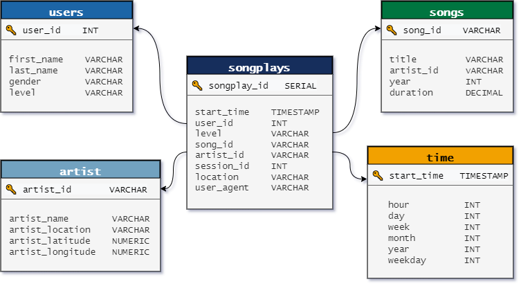

# Project: Data Modeling with Postgres
> by Steve Nalos, January 2022

## Introduction

A startup called Sparkify wants to analyze the data they've been collecting on songs and user activity on their new music streaming app. The analytics team is particularly interested in understanding what songs users are listening to. Currently, they don't have an easy way to query their data, which resides in a directory of JSON logs on user activity on the app, as well as a directory with JSON metadata on the songs in their app.

## Project Description

The general objective of this project is to create a (1) Postgres database schema with tables designed for optimizing queries on Sparkify song play analysis. A fact and dimension tables for a star schema for a particular analytic focus was created (Python & SQL). The second goal of the project is to write an ETL pipeline for such analysis which will enable the transferring of data from files in two local directories into the created tables in Postgres (Python & SQL)

## Datasets

#### Song Dataset

The first dataset is a subset of real data from the [Million Song Dataset](http://millionsongdataset.com/). Each file is in JSON format and contains metadata about a song and the artist of that song. The files are partitioned by the first three letters of each song's track ID. For example, here are filepaths to two files in this dataset:

`song_data/A/B/C/TRABCEI128F424C983.json`
`song_data/A/A/B/TRAABJL12903CDCF1A.json`

And below is an example of what a single song file, TRAABJL12903CDCF1A.json, looks like.

`{"num_songs": 1, "artist_id": "ARJIE2Y1187B994AB7", "artist_latitude": null, "artist_longitude": null, "artist_location": "", "artist_name": "Line Renaud", "song_id": "SOUPIRU12A6D4FA1E1", "title": "Der Kleine Dompfaff", "duration": 152.92036, "year": 0}`

#### Log Dataset

The second dataset consists of log files in JSON format generated by this [event simulator](https://github.com/Interana/eventsim) based on the songs in the dataset above. These simulate activity logs from a music streaming app based on specified configurations.

The log files in the dataset I was working with are partitioned by year and month. For example, here are filepaths to two files in this dataset:

`log_data/2018/11/2018-11-12-events.json`
`log_data/2018/11/2018-11-13-events.json`

And below is an example of what the data in a log file, 2018-11-12-events.json, looks like:

## Database Schema for Song Play Analysis

Using the song and log datasets, I created a denormalized star schema optimized for fast agregations and simplified queries on song play analysis. This includes one fact table of **songplays** and four dimension tables for **users, songs, artists, and time**:

## Files

In addition to the data files, the project includes six files:

1. `test.ipynb` displays the first few rows of each table to let me check my database.
2. `create_tables.py` drops and creates tables. I run this file to reset my tables before each time I run the ETL scripts.
3. `etl.ipynb` reads and processes a single file from song_data and log_data and loads the data into the tables. This notebook contains detailed instructions on the ETL process for each of the tables.
4. `etl.py` reads and processes files from song_data and log_data and loads them into the tables. It's based on my work in the ETL notebook.
4. `sql_queries.py` contains all my sql queries, and is imported into the last three files above.
5. `README.md` then provides an introduction to this project.

# Project Steps
**NOTE:** You will not be able to run test.ipynb, etl.ipynb, or etl.py until you have run create_tables.py at least once to create the sparkifydb database, which these other files connect to.

## Create Tables
1. Write CREATE statements in sql_queries.py to create each table.
2. Write DROP statements in sql_queries.py to drop each table if it exists.
3. Run create_tables.py to create your database and tables.
4. Run test.ipynb to confirm the creation of your tables with the correct columns. Make sure to click "Restart kernel" to close the connection to the database after running this notebook.

## Building an ETL Processes

**Extract, transform, load (ETL)** is is the process data engineers use to extract data from different sources, transform the data into a  usable and trusted resource, and load that data into the systems end-users can access and use downstream to solve business problems.

An **ETL pipeline (or data pipeline)** is the mechanism by which ETL processes occur. Data pipelines are a set of tools and activities for moving data from one system with its method of data storage and processing to another system in which it can be stored and managed differently.

1. Run **create_tables.py** and **sql_queries.py**
2. Follow the instructions on **etl.ipynb**. You can think of etl.ipynb as a sample ETL Process but it only does ETL on one data file instead of the whole collection of files/data. 
3. Run **test.ipynb** to check that records were successfully inserted into each table. You may need to correct few lines of codes in your **sql_queries.py** to correct filetype errors. 

#### Building an ETL Pipeline

By this time, the ETL Processes you've built previously is now ready to be implemented in building the ETL Pipeline for the entire datasets. You will just replicate some line of codes in etl.ipynb to **etl.py** which is the code source for the ETL Pipeline that does ETL of the song_data and log_data files to the sparkifydb database. 

## References
1. ETL-Process Image - https://databricks.com/glossary/extract-transform-load