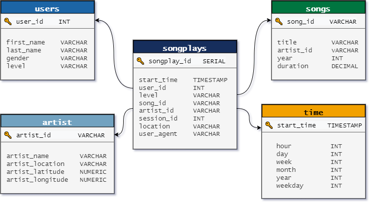

# Project: Data Warehouse
> by Steve Nalos, March 23, 2022

## Introduction

A music streaming startup, Sparkify, has grown their user base and song database and want to move their processes and data onto the cloud. Their data resides in S3, in a directory of JSON logs on user activity on the app, as well as a directory with JSON metadata on the songs in their app.

As their data engineer, you are tasked with building an ETL pipeline that extracts their data from S3, stages them in Redshift, and transforms data into a set of dimensional tables for their analytics team to continue finding insights into what songs their users are listening to. You'll be able to test your database and ETL pipeline by running queries given to you by the analytics team from Sparkify and compare your results with their expected results.

## Project Description

The project will need to load data from S3 to staging tables on Redshift and execute SQL statements that create the analytics tables from these staging tables.

## Datasets

#### Project Datasets
You'll be working with two datasets that reside in S3. Here are the S3 links for each:
- Song data: `s3://udacity-dend/song_data`
- Log data: `s3://udacity-dend/log_data`

Log data json path: `s3://udacity-dend/log_json_path.json`

#### Song Dataset

The first dataset is a subset of real data from the [Million Song Dataset](http://millionsongdataset.com/). Each file is in JSON format and contains metadata about a song and the artist of that song. The files are partitioned by the first three letters of each song's track ID. For example, here are filepaths to two files in this dataset:

`song_data/A/B/C/TRABCEI128F424C983.json`
`song_data/A/A/B/TRAABJL12903CDCF1A.json`

And below is an example of what a single song file, TRAABJL12903CDCF1A.json, looks like.

`{"num_songs": 1, "artist_id": "ARJIE2Y1187B994AB7", "artist_latitude": null, "artist_longitude": null, "artist_location": "", "artist_name": "Line Renaud", "song_id": "SOUPIRU12A6D4FA1E1", "title": "Der Kleine Dompfaff", "duration": 152.92036, "year": 0}`

#### Log Dataset

The second dataset consists of log files in JSON format generated by this [event simulator](https://github.com/Interana/eventsim) based on the songs in the dataset above. These simulate activity logs from a music streaming app based on specified configurations.

The log files in the dataset I was working with are partitioned by year and month. For example, here are filepaths to two files in this dataset:

`log_data/2018/11/2018-11-12-events.json`
`log_data/2018/11/2018-11-13-events.json`

And below is an example of what the data in a log file, 2018-11-12-events.json, looks like:

## Database Schema for Song Play Analysis

Using the song and log datasets, I created a denormalized star schema optimized for fast agregations and simplified queries on song play analysis. This includes one fact table of **songplays** and four dimension tables for **users, songs, artists, and time**. Sorkey and distkey were also used to optimized the queries of analytics team. 

## Files

In addition to the data files, the project includes six files:

1. `provision.ipynb` is an IaC used to provision necessary AWS resources. 
2. `create_tables.py` drops and creates tables. I run this file to reset my tables before each time I run the ETL scripts.
3. `etl.py` script used to load the data from S3 into staging stables on Redshift and then process that data into analytics tables on Redshift. 
4. `sql_queries.py` contains all my sql queries, and is imported into the last two files above.
5. `README.md` then provides an introduction to this project.

# Project Steps
**NOTE:** You will not be able to run test.ipynb, etl.ipynb, or etl.py until you have run create_tables.py at least once to create the sparkifydb database, which these other files connect to.

## Create Table Schemas
1. Design schemas for your fact and dimension tables
2. Write a SQL `CREATE` statement for each of these tables in `sql_queries.py`
3. Complete the logic in `create_tables.py` to connect to the database and create these tables
4. Write SQL `DROP` statements to drop tables in the beginning of `create_tables.py` if the tables already exist. This way, you can run `create_tables.py` whenever you want to reset your database and test your ETL pipeline.
5. Launch a redshift cluster and create an IAM role that has read access to S3. *Navigate to the next subsection.
6. Add redshift database and IAM role info to `dwh.cfg`.
7. Test by running `create_tables.py` and checking the table schemas in your redshift database. You can use Query Editor in the AWS  Redshift console for this.

## Provision AWS Resources [Optional] 
1. Execute steps in `provision.ipynb`. This will provision necessary aws resources through IaC.
2. Take Note of IAM Role ARN & DWH ENDPOINT. 
3. Copy IAM Role ARN and DWH ENDPOINT into `dwh.cfg`; fill-out the necessary fields (ARN & Host). 

## Building an ETL Pipeline

**Extract, transform, load (ETL)** is is the process data engineers use to extract data from different sources, transform the data into a  usable and trusted resource, and load that data into the systems end-users can access and use downstream to solve business problems.

An **ETL pipeline (or data pipeline)** is the mechanism by which ETL processes occur. Data pipelines are a set of tools and activities for moving data from one system with its method of data storage and processing to another system in which it can be stored and managed differently.

1. Implement the logic in `etl.py` to load data from S3 to staging tables on Redshift.
2. Implement the logic in `etl.py` to load data from staging tables to analytics tables on Redshift.
3. Test by running `etl.py` after running `create_tables.py` and running the analytic queries on your Redshift database to compare your results with the expected results.
4. Delete your redshift cluster when finished.
