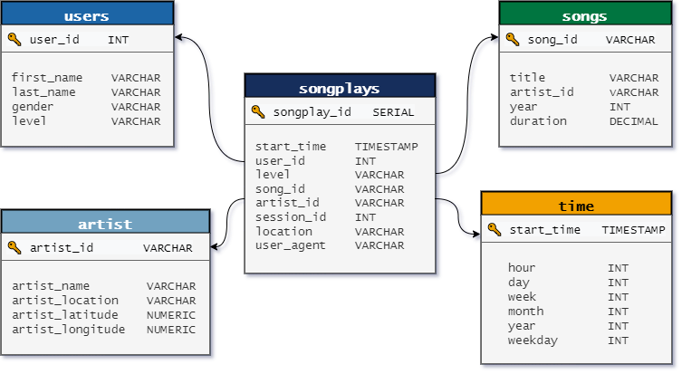
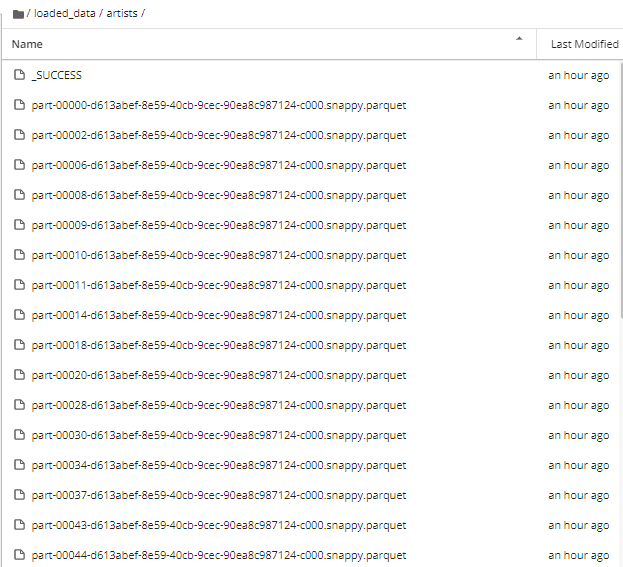

# Project: Data Warehouse
> by Steve Nalos, April 3, 2022

## Introduction

A music streaming startup, Sparkify, has grown their user base and song database even more and want to move their data warehouse to a data lake. 
Their data resides in S3, in a directory of JSON logs on user activity on the app, as well as directory with JSON metadata on the songs in their app.

As their data engineer, you are tasked with building an ETL pipeline that extracts their data from S3, processes them using Spark, and loads the data
back into S3 as a set of dimensional tables. This will allow their analytics team to continue finding insights in what songs their users are 
listening to. 

## Project Description

The project involves loading data from an S3 bucket, processing it into analytics tables using Spark, and load them back into S3. AWS EMR was used to
deply such Spark processes on the EMR clusters. 

## Datasets

#### Project Datasets
You'll be working with two datasets that reside in S3. Here are the S3 links for each:
- Song data: `s3a://udacity-dend/song_data`
- Log data: `s3a://udacity-dend/log_data`

Log data json path: `s3://udacity-dend/log_json_path.json`

#### Song Dataset

The first dataset is a subset of real data from the [Million Song Dataset](http://millionsongdataset.com/). Each file is in JSON format and contains metadata about a song and the artist of that song. The files are partitioned by the first three letters of each song's track ID. For example, here are filepaths to two files in this dataset:

`song_data/A/B/C/TRABCEI128F424C983.json`
`song_data/A/A/B/TRAABJL12903CDCF1A.json`

And below is an example of what a single song file, TRAABJL12903CDCF1A.json, looks like.

`{"num_songs": 1, "artist_id": "ARJIE2Y1187B994AB7", "artist_latitude": null, "artist_longitude": null, "artist_location": "", "artist_name": "Line Renaud", "song_id": "SOUPIRU12A6D4FA1E1", "title": "Der Kleine Dompfaff", "duration": 152.92036, "year": 0}`

#### Log Dataset

The second dataset consists of log files in JSON format generated by this [event simulator](https://github.com/Interana/eventsim) based on the songs in the dataset above. These simulate activity logs from a music streaming app based on specified configurations.

The log files in the dataset I was working with are partitioned by year and month. For example, here are filepaths to two files in this dataset:

`log_data/2018/11/2018-11-12-events.json`
`log_data/2018/11/2018-11-13-events.json`

And below is an example of what the data in a log file, 2018-11-12-events.json, looks like:

## Database Schema for Song Play Analysis

Using the song and log datasets, I created a denormalized star schema optimized for fast agregations and simplified queries on song play analysis. This includes one fact table of **songplays** and four dimension tables for **users, songs, artists, and time**. Sorkey and distkey were also used to optimized the queries of analytics team. 

## Files

In addition to the data files, the project includes six files:

1. `etl.py` script used to load the data from S3, and process it using Spark, and transport back again to S3.  
2. `dl.cfg` contains my AWS credentials. 
3. `README.md` then provides an introduction to this project.

# Project Steps [Using S3 buckets and Amazon Redshift]
1. Supply the necessary AWS credentials in the `dl.cfg` such as AWS ID and Secret Access Key. 

2. Launch an Amazon EMR Cluster. 
    2.1 Release: emr-5.20.0 or later
    
    2.2 Applications: Spark: Spark 2.4.0 on Hadoop 2.8.5 YARN with Ganglia 3.7.2 and Zeppelin 0.8.0
    
    2.3 Instance type: m3.xlarge
    
    2.4 Number of instance: 3
    
    2.5 EC2 key pair: Proceed without an EC2 key pair or feel free to use one if you'd like
    
3. Launch  Notebook

    3.1 Enter Notebook name. 
    
    3.2 Choose the cluster you have created. 
    
    3.3 Leave everything else as default. 
    
4. Run etl.py

# Project Steps [Local Files]
1. In the `etl.py`, supply the right path location for the `input_data` and `output_data`. 
2. Run etl.py

# Project Output
The project ends up with five seperate directories named after, and corresponding to each tables. Each directories will contain loaded parquet files from the json files from the input directory. A parquet file is a columnar data format that is used by Amazon EMR.  

The sample directory for `artists_table` is shown below. 
